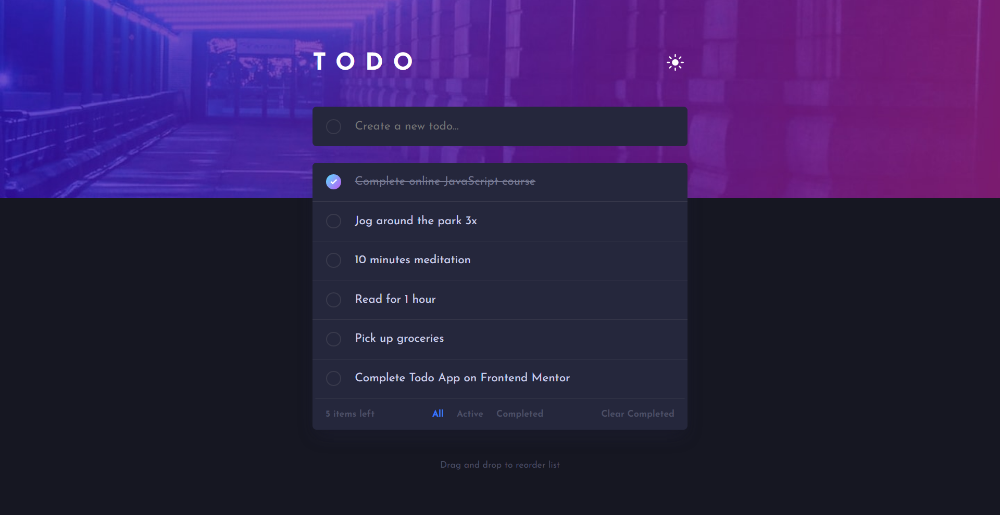

# Frontend Mentor - Todo app solution

This is a solution to the [Todo app challenge on Frontend Mentor](https://www.frontendmentor.io/challenges/todo-app-Su1_KokOW). Frontend Mentor challenges help you improve your coding skills by building realistic projects.

## Table of contents

- [Overview](#overview)
  - [The challenge](#the-challenge)
  - [Screenshot](#screenshot)
  - [Installation and Setup](#installation)
  - [Links](#links)
- [My process](#my-process)
  - [Built with](#built-with)
  - [Continued development](#continued-development)
- [Author](#author)

## Overview

### The challenge

Users should be able to:

- View the optimal layout for the app depending on their device's screen size
- See hover states for all interactive elements on the page
- Add new todos to the list
- Mark todos as complete
- Delete todos from the list
- Filter by all/active/complete todos
- Clear all completed todos
- Toggle light and dark mode
- **Bonus**: Drag and drop to reorder items on the list

### Screenshot

### Installation

#### Example:

- Clone this repository. You will need node and npm installed globally on your machine.

Installation:

`npm install`

To Run Test Suite:

`npm test`

To Start Server:

`npm start`
Open [http://localhost:3000](http://localhost:3000) to view it in the browser.

### Links

- Solution URL: [Add solution URL here](https://your-solution-url.com)
- Live Site URL: [Demo](https://todoapp-redux-dngtnv.netlify.app/)

## My process

### Built with

- CSS custom properties
- Desktop-first workflow
- SCSS
- [React](https://reactjs.org/) - JS library
- [Redux Core](https://redux.js.org/introduction/installation)

### Continued development

- Build this project as a full-stack application

## Author

- Frontend Mentor - [@dngtnv](https://www.frontendmentor.io/profile/dngtnv)
